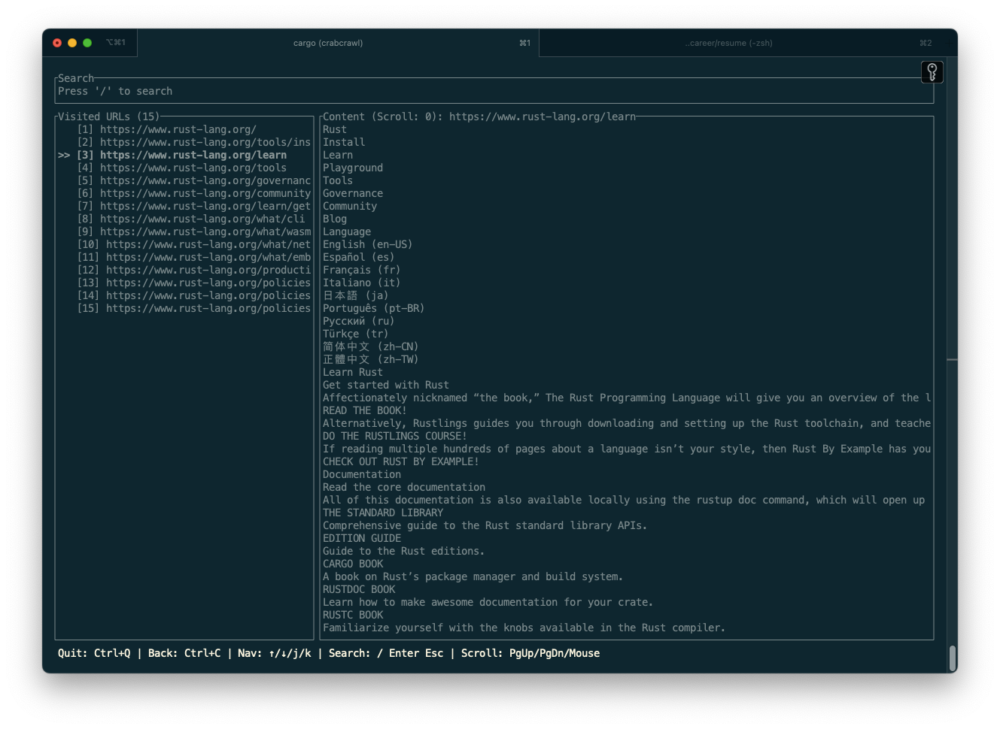
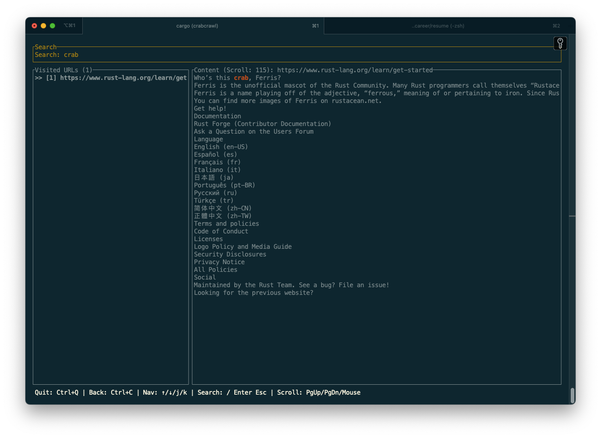

# Crab Crawl!



This is basically a project for me to learn rust. It launches a neat terminal UI that takes in a URL, recursively searches for all relative links on the page, and displays them and their text content in a column type setup.

There is a search interface that allows you to search for specific keywords within the text content of the links.



The idea is to spider the website and allow the user to search for keywords within it. Better watch out Google, Crab Crawl is coming for you.

It uses geckodriver to render html so you'll need to install that and run that. Instructions below.

Hardcoded urls, etc etc. This will probably blow up your computer.

Heavily relied on grok and gemini-2.5 for this.

### Setup

Make sure to run geckodriver which is used to render html.

#### Install geckodriver

bash
```
brew install geckodriver
```

#### Run geckodriver

bash
```
geckodriver --port 4444
```

### Run the Crawl program

bash
```
cargo run
```
